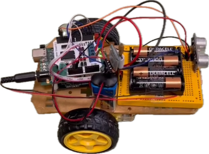
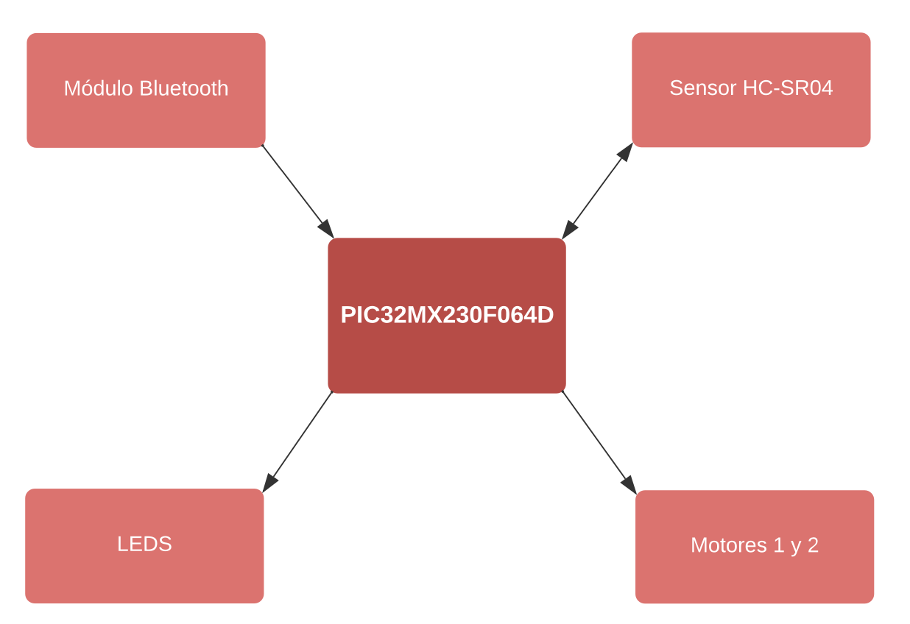

# Coche RC de carreras con detección de obstáculos

## Descripción del Sistema
Este proyecto consiste en la implementación de un coche RC de carreras con detección de obstáculos, basado en
la arquitectura del PIC32MX230F064D. Para el control del mismo, haremos uso de la tecnología Bluetooth. Destacar
que el coche es capaz de moverse en todas las direcciones a través de la aplicación Bluetooth RC Car Control DIY, con un alcance de hasta 30 metros.

## Dispositivos de Entrada/Salida
Los dispositivos de entrada de nuestro proyecto son los siguientes:

- RX UART: implementado mediante el módulo bluetooth HC-06 de Arduino. Su objetivo es recibir los
caracteres que le llegan desde la aplicación móvil para posteriormente mandárselos al motor.
- ECHO sensor HC-SR04: su objetivo es medir la distancia del obstáculo más cercano y así controlar el motor
evitando un posible choque frontal. Para obtener la distancia del objeto más cercano en cm, basta con
dividir el tiempo en alto que está la señal (en µs) por un factor de 58. Se usa el timer 5 en modo gated para
medir el tiempo en alto de la señal.

Por otro lado, contamos con las siguientes salidas:

- LEDS RC0-RC3: los cuales se encenderán en caso de detectar un obstáculo cercano y apagarse los motores.
Emulan el funcionamiento de las luces traseras de un coche.
- TRIGGER sensor HC-SR04: se lanza un pulso de 10µs cada 50ms para inicializar el sensor ultrasonidos y
buscar obstáculos cercanos. Se usa el timer 4 para generar la señal.
- Motores coche: se usan 2 motores independientes compatibles con la tarjeta L298N Motor Shield V12 de
Arduino. Funcionan con una frecuencia de 10 KHz cuyas velocidades dependen del tiempo en alto de la
señal. Se han usado los OC 1 y 2 con los Timers 2 y 3 correspondientemente.

## Diagrama de Bloques

